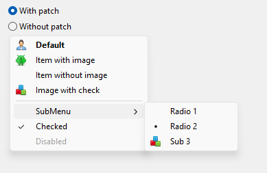

## VclMenuHack
Patches TMenu class to paint themed menu’s icons

With patch:

Without patch:

#### Usage
Include reference to Vcl.Menus.Hack unit anywhere in your project, and call
`TMenuHack.Start;` to apply system painting. Calling `TMenuHack.Stop;` returns default Delphi painting.